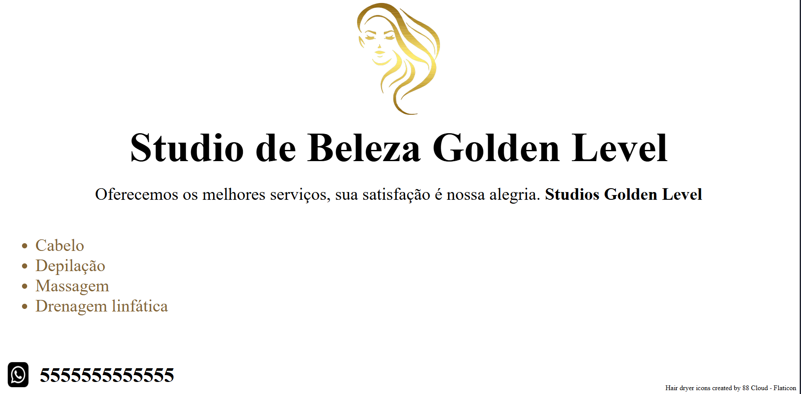
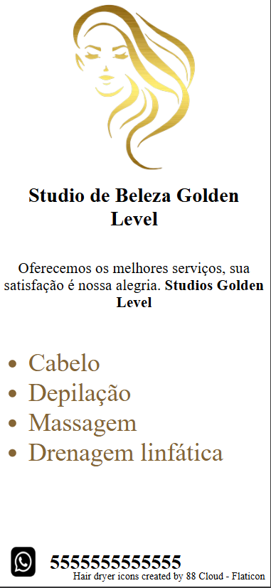
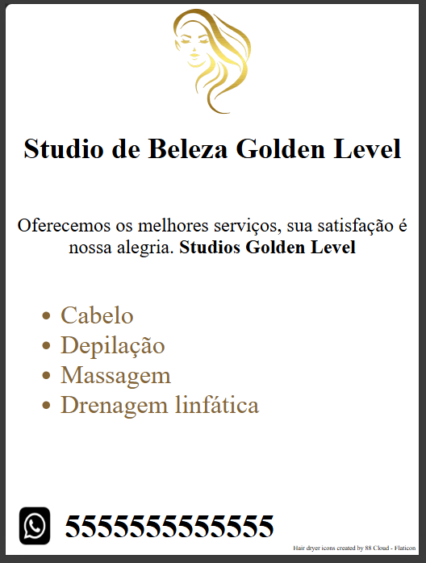
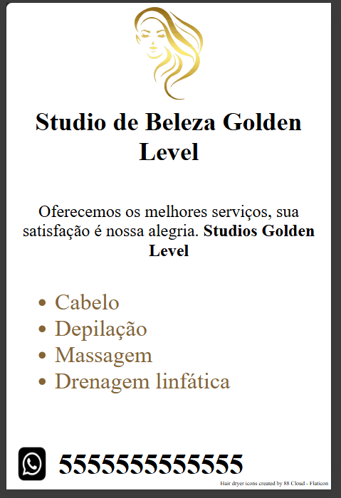

# Projeto Salão de Beleza

## imagens da landing page

## link da landing page

https://williamleles.github.io/projeto_salao_de_beleza/

## O que eu fiz
Usando meus conhecimentos criei uma landing page de um salão de beleza utilizando html, css e aplicando conceitos de ux e ui design

## Objetivo
Meu objetivo ao criar esta landing page responsiva é demonstrar meu conhecimento nessa área, dar inicio a construção do meu portfólio e aprender durante o processo

## O processo
Fiz este design com a metodologia mobile first, estilizando primeiramente para celulares e somente depois estilizando para tablets e computadores com organização na responsividade
Também prestei atenção à semântica no projeto todo, utilizando as tags corretas semânticamente e construindo o projeto com acessibilidade e atenção aos mecanismos de busca

## Como executar o projeto

1. Baixe ou clone este repositório
2. Abra o arquivo index.html no navegador

## tecnologias usadas
- HTML5
- CSS3
- Responsividade (media queries)
- Mobile first
- Semântica html
- acessibilidade basica
